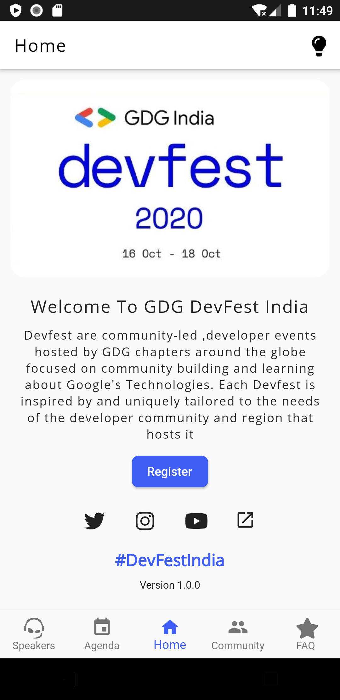
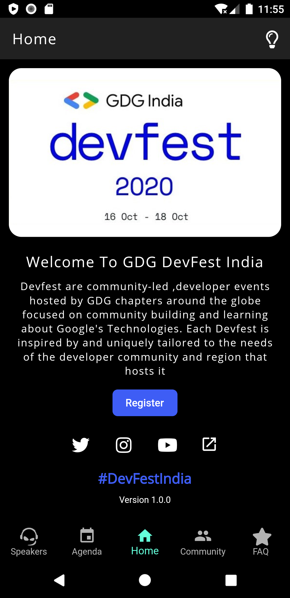
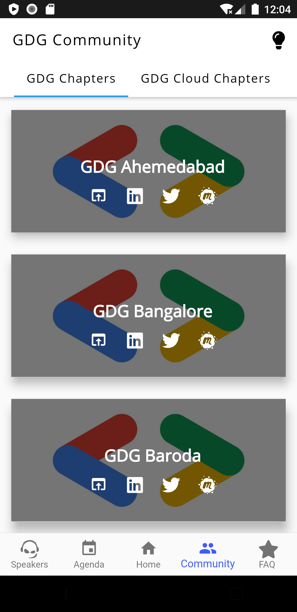
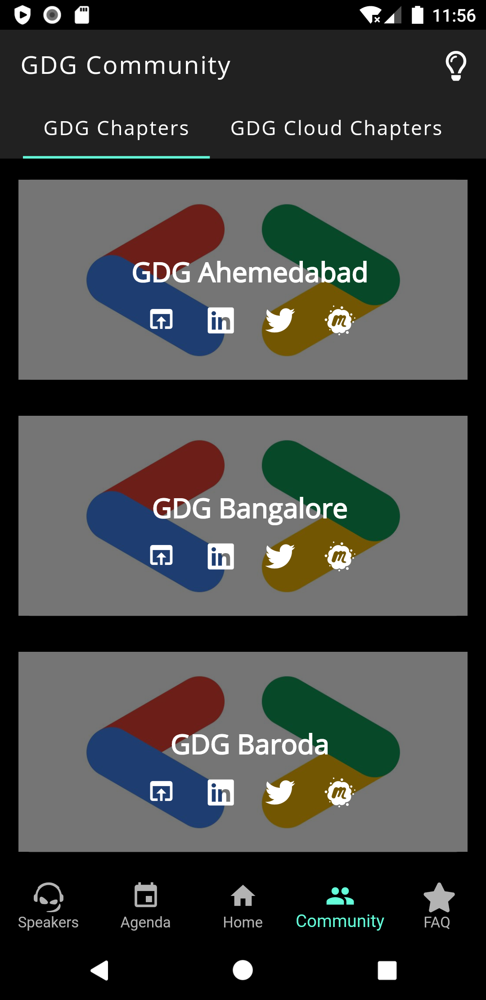
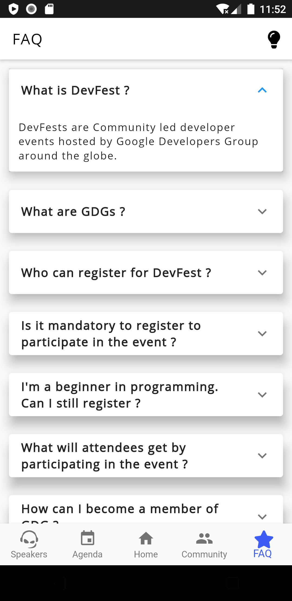
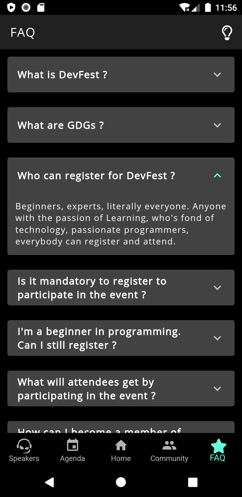

# GDG Devfest India 2020

  

## 📸 ScreenShots

|             Light Theme              |              Dark Theme              |
| :----------------------------------: | :----------------------------------: |
|    | |
|    | |
|    |                                 |

### Show some :heart: and star the repo to support the project

## Overview
Devfest India Mobile Application is not an Official App for the GDG Devfest , Its been made as a part of my Side Project using Flutter. You can see the Agenda , Speakers , browse through all GDG Chapters India at One Place and all other updates regarding the devfest.  

## Technology Stack

- Flutter
- Flutter Bloc (For Dynamic Theming)

## Getting Started 🚀
- Fork The Repo
- Clone the repo `git clone https://github.com/Sahil-kachhap/GDG-Devfest-India`
- Install the dependicies `flutter pub get`
- Run it `flutter run`

